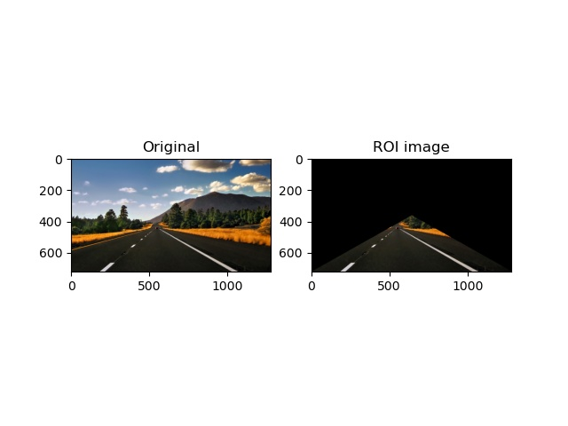

# Road-lane-ROI-extraction

#### This project finds out a region of interest (ROI) for the road lane detection. This is capable of properly defining the lane that will assist the driver and make his experience seemless and great. 

#### This can be a good connecting node for the SMART cars. 

